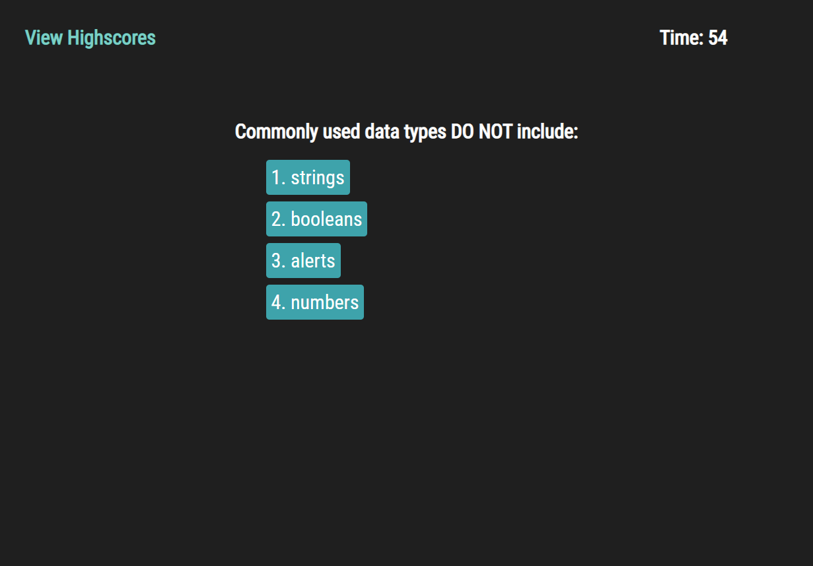

# Timed-Quiz

## What was the Timed Coding Quiz about?

We were tasked with creating a quiz that displays new questions as you click through them.  They also wanted the timer to be docked by seconds if you got an answer incorrect.  At the end of the quiz, you are provided with a final score and an area to input your initials.  This data is then stored on your local device to create a Highscores screen.

## How did I do it?

1. I created my HTML that houses all of my questions.
2. I created the Javascript that replaces each question as you answer it and pops up with an alert to let you know whether or not you've gotten the question correct.
3. I had the quiz add points as you get a question correct and deduct time as you answer the questions incorrectly.  Your time left is then added to your final score so you are rewarded with extra points if you answer the questions correctly and quickly.
4. At the end of the game, you are presented with your final score and you are able to input your initials and save your score to the Highscores screen.
5. You also have a screen that displays the scores of the most recent players.

## Examples of How the Quiz Looks

## Take the Quiz here!
